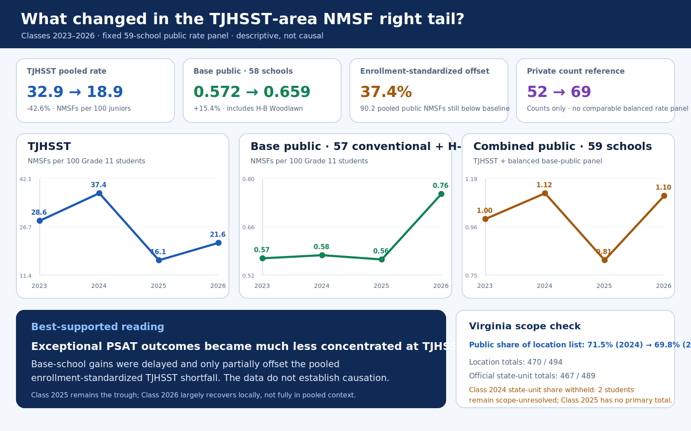

# TJHSST-Area PSAT Analysis



This repository builds a sourced, reproducible panel for studying National Merit
Semifinalist (NMSF) outcomes in the TJHSST geographic area. It combines a
canonical school roster, school-level NMSF observations, grade-11 enrollment
denominators, validation reports, descriptive outputs, and a guarded
interpretation of the results for graduating Classes 2019-2026.

## Research question and claim boundary

The project asks whether TJHSST's post-2020 admissions change coincided with a
change in extreme-right-tail PSAT outcomes at TJHSST and whether changes at base
public or private schools offset that decline after accounting for class size.
A TJHSST-only decline is not enough to answer that question, so the analysis
tests regional and sector-level patterns as well.

NMSF is a narrow outcome. It does not measure median achievement, student
well-being, school quality, academic culture as a whole, or whether an admissions
policy was good or bad. The analysis is descriptive, not causal: it does not
observe school-level PSAT participation, applicants' counterfactual schools,
student-level admissions pathways, or broader achievement distributions.

## Current findings

The public-data analysis is complete at the documented stopping point. The most
defensible conclusions are:

- TJHSST's NMSF count and enrollment-normalized rate fall sharply in Class 2025
  and partially rebound in Class 2026, while remaining below the pre-policy
  range.
- A balanced base-public panel comprising 57 conventional high schools plus H-B
  Woodlawn is nearly flat in Class 2025 and rises in Class 2026. The increase is
  delayed and heterogeneous rather than a uniform regional shift.
- The combined local public rate nearly returns to its Class 2024 level in Class
  2026, but pooling Classes 2025-2026 and standardizing for enrollment still
  leaves a shortfall relative to the groups' prior rates. These annual and pooled
  comparisons answer different questions and should not be treated as
  interchangeable.
- College Board's Virginia benchmark is nearly flat—reported 11th-grade
  PSAT/NMSQT participation is 50% for Classes 2023-2024 and 49% for Classes
  2025-2026. Applying that benchmark or a wider group-specific ±10% stress grid
  preserves the pooled TJHSST decline, positive base-public increase, partial
  offset, and combined-public shortfall. The offset itself ranges from 10.6% to
  80.7%, so its direction is more robust than its magnitude; near-zero annual
  comparisons can flip sign.
- The 16 rostered private schools have complete source-backed focal-period counts:
  52 NMSFs in Classes 2023-2024 and 69 in Classes 2025-2026. Missing comparable
  denominators, residence, eligibility, and counterfactual-placement data prevent
  treating that increase as a measured displacement offset.

See `reports/analysis.md` for the full findings, robustness checks, limitations,
and integrity summary.

## Coverage and unresolved items

- The canonical panel contains 608 rows: 76 schools across Classes 2019-2026.
- Classes 2023, 2024, and 2026 have complete source-backed NMSF count coverage.
- Class 2025 retains one public `missing_source` row, Meridian High School. Its
  absence from incomplete sources is not evidence of zero; a named-list
  reconciliation now establishes verified zeros for the four formerly missing
  LCPS rows.
- The fixed public rate panel contains TJHSST, 57 conventional base public
  schools, and H-B Woodlawn with compatible counts and denominators in every
  focal year.
- Targeted official Grade 11 sources add H-B Woodlawn denominators of 109, 109,
  115, and 110 for Classes 2023-2026; Loudoun School for Advanced Studies at 11
  for Class 2023; and BASIS Independent McLean at 29 and 40 for Classes 2025 and
  2026; Trinity Christian at 91 for Class 2024; and Immanuel Christian at 49 for
  Class 2026.
- Thirty-nine focal private school-year denominators remain unresolved without
  adjacent-year estimation: five in Class 2023 (Flint Hill, Oakcrest, Potomac,
  Pinnacle, and Seton), 15 in Class 2024 (all except Trinity Christian), five in
  Class 2025 (Flint Hill, Oakcrest, Potomac, Loudoun School for Advanced Studies,
  and Seton), and 14 in Class 2026 (all except BASIS Independent McLean and
  Immanuel Christian).
- Virginia school-location media-packet totals are 400, 470, and 494 for Classes
  2023, 2024, and 2026; the official NMSC state-selection-unit totals are 397,
  467, 394, and 489 for Classes 2023-2026. Official focal cutoffs are 221, 219,
  222, and 224. Class 2025 still lacks the complete location list. The two scopes
  are retained separately: boarding-school blocks reconcile Classes 2023 and
  2026, while two Class 2024 students remain scope-unresolved.
- An FCPS-origin Class 2025 admissions workbook provides source-school applicants,
  waitpool, and offers, but cells of 10 or fewer are suppressed. It reduces the
  admissions-data gap without supplying acceptance, enrollment, allocation-pool,
  counterfactual, or comparable Class 2026 data.
- Historical non-FCPS Classes 2019-2022 source backfill is optional and is not
  required for the current focal-period conclusions.

The highest-value additions are a complete Class 2025 Virginia school list,
school-level PSAT participation and score distributions, the remaining exact-year
private grade-11 denominators, complete TJHSST applicant/offer/acceptance/enrollment
records by source school and allocation pool, and broader upper-tail outcomes.

## Documentation and outputs

The repository intentionally keeps only two hand-maintained entry points:

- `README.md`: project scope, status, workflow, and operating rules.
- `docs/data_dictionary.md`: data products, fields, statuses, and output
  semantics.

Analytical Markdown, CSV, and SVG outputs under `reports/` are generated from
committed inputs. `reports/conclusion_graphic.svg` is the data-driven presentation
graphic embedded above; `reports/conclusion_graphic.png` is its raster snapshot.

- `reports/analysis.md`: consolidated findings, robustness checks, limitations,
  and reproduction/integrity record.
- `reports/descriptive_results.md`: descriptive figure and table inventory with
  coverage warnings.
- `reports/data_quality/`: roster, enrollment, source-reconciliation, and final
  panel audit reports.
- `reports/tables/` and `reports/figures/`: machine-readable analytical tables
  and rendered charts.
- `data/processed/analysis_panel.csv`: canonical analytical panel.
- `data/processed/tjhsst_class_2025_admissions_by_source_school.csv`: partial
  source-school admissions extract with explicit FERPA suppression statuses.

Source-specific notes live next to the source artifacts. `data/raw/nmsf/README.md`
documents the count-only NMSF snapshots, and
`docs/source_notes/analysis_research_sources.md` records external sources used
only for interpretation and supplemental checks.

## Reproduce

Install the project and development dependencies once with `uv sync --extra
dev`. Then regenerate the committed artifacts in dependency order:

```bash
UV_CACHE_DIR=.uv-cache uv run --no-sync python scripts/build_seed_data.py
UV_CACHE_DIR=.uv-cache uv run --no-sync python scripts/build_school_roster.py
UV_CACHE_DIR=.uv-cache uv run --no-sync python scripts/ingest_nmsc_virginia_lists.py
UV_CACHE_DIR=.uv-cache uv run --no-sync python scripts/build_enrollment_panel.py
UV_CACHE_DIR=.uv-cache uv run --no-sync python scripts/ingest_tjhsst_admissions.py
UV_CACHE_DIR=.uv-cache uv run --no-sync python scripts/apply_nmsf_counts.py
UV_CACHE_DIR=.uv-cache uv run --no-sync python scripts/build_nmsf_observations.py
UV_CACHE_DIR=.uv-cache uv run --no-sync python scripts/build_nmsf_pilot_2023_2026.py
UV_CACHE_DIR=.uv-cache uv run --no-sync python scripts/build_focal_period_completion.py
UV_CACHE_DIR=.uv-cache uv run --no-sync python scripts/build_analysis_panel.py
UV_CACHE_DIR=.uv-cache uv run --no-sync python scripts/build_descriptive_outputs.py
UV_CACHE_DIR=.uv-cache uv run --no-sync python scripts/build_analysis_reports.py
UV_CACHE_DIR=.uv-cache uv run --no-sync python scripts/build_conclusion_graphic.py
UV_CACHE_DIR=.uv-cache uv run --no-sync python scripts/validate_nmsf_sources.py data/interim/panel_nmsf.csv
```

Run the development checks with:

```bash
UV_CACHE_DIR=.uv-cache uv run --no-sync python -m ruff format --check .
UV_CACHE_DIR=.uv-cache uv run --no-sync python -m ruff check .
UV_CACHE_DIR=.uv-cache uv run --no-sync python -m mypy
UV_CACHE_DIR=.uv-cache uv run --no-sync python -m unittest discover -s tests
```

## Data and provenance rules

- Treat `docs/source_notes/tj psat investigation.xlsx` as the roster and legacy
  enrollment seed. `data/manual/tj psat investigation.xlsx` is the byte-identical
  pipeline copy.
- Do not use the workbook sheet `nsmf 2019` as count evidence.
- Every numeric NMSF count, including zero, requires a source URL, title, date,
  and validated source hash.
- A missing school in an incomplete article remains blank; it is not zero.
- Use `verified_zero` only when a complete named list covers the relevant
  geography and class year.
- Keep TJHSST as one school row. Jurisdictional references to students attending
  TJHSST are retained only for source reconciliation and are not split back to
  base schools.
- Preserve school renames, openings, and relocations in the roster history.
- Private schools remain non-public/unallocated analytical buckets. School
  location does not establish residence, TJ eligibility, application status, or
  counterfactual public-school placement.
- Grade-11 enrollment is an outcome denominator for NMSF rates, not an input to
  TJHSST admissions-seat allocation.

## Class-year mapping

| Graduating class | Qualifying PSAT | Grade-11 enrollment year |
| ---: | ---: | ---: |
| 2019 | Fall 2017 | 2017-18 |
| 2020 | Fall 2018 | 2018-19 |
| 2021 | Fall 2019 | 2019-20 |
| 2022 | Fall 2020 | 2020-21 |
| 2023 | Fall 2021 | 2021-22 |
| 2024 | Fall 2022 | 2022-23 |
| 2025 | Fall 2023 | 2023-24 |
| 2026 | Fall 2024 | 2024-25 |

## Admissions-policy source boundary

Regulation 3355.16 supports the current roster treatment of non-public
applicants and the unallocated-seat pool, but it became effective after the
Class 2026 notification date and is not applied retroactively to the focal
Classes 2025 or 2026. Historical interpretation uses Regulation 3355.14,
Regulation 3355.15, official class-specific FCPS bulletins, Board materials, and
the documented absence of archived annual Notice 3355 procedures. The reports
describe the broad class-specific regimes without claiming that every
implementation detail has been reconstructed.
